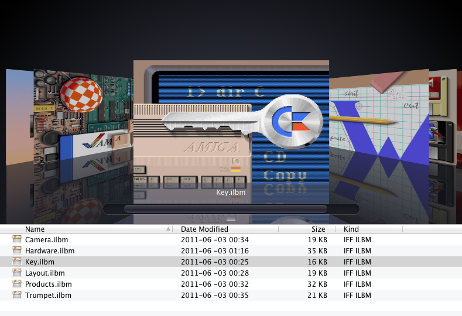

ql-iff
======

OS X Quick Look plugin for IFF ILBM images
Version 1.0 Beta (March 22, 2013)

Supported IFF-features:

* ILBM and PBM
* 1-8 bitplanes
* Extra halfbrite
* Hold and modify
* Transparency

Install:

* For one user, copy iff.qlgenerator to ~/Library/QuickLook/
* For all users, copy iff.qlgenerator to /Library/QuickLook/

Download latest version from [https://github.com/dalton-tulou/ql-iff/releases/download/v1.0-beta/ql-iff.zip](ql-iff.zip)

Source code available at https://github.com/dalton-tulou/ql-iff

Coded by David Revelj

Be cool, stay in school!
